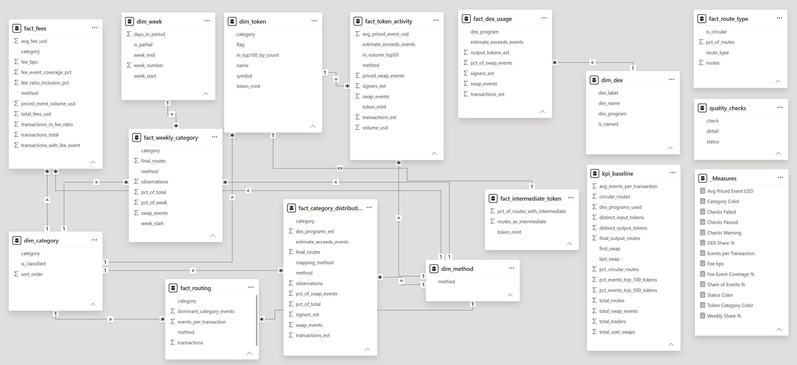
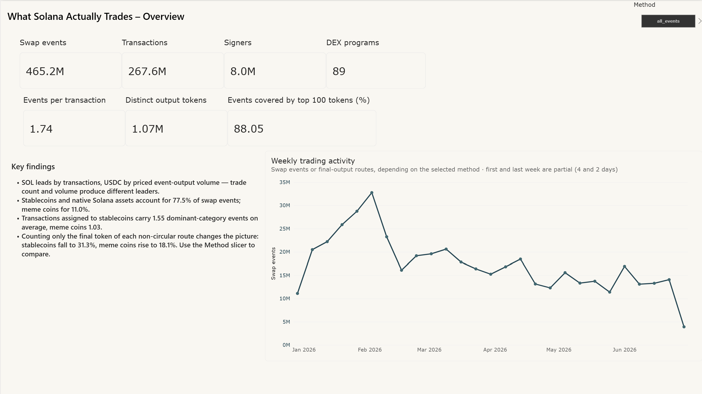
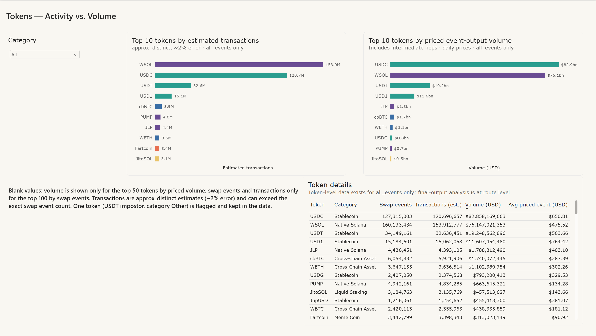
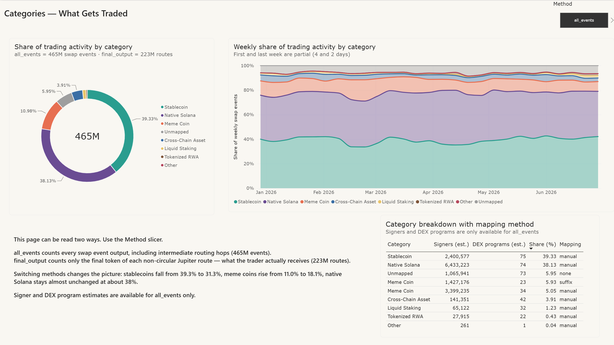
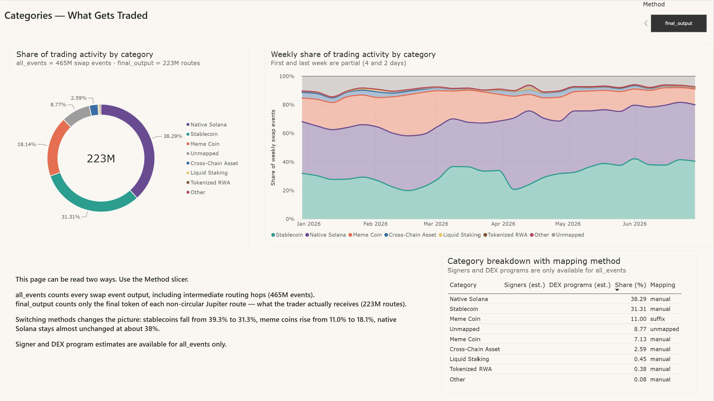
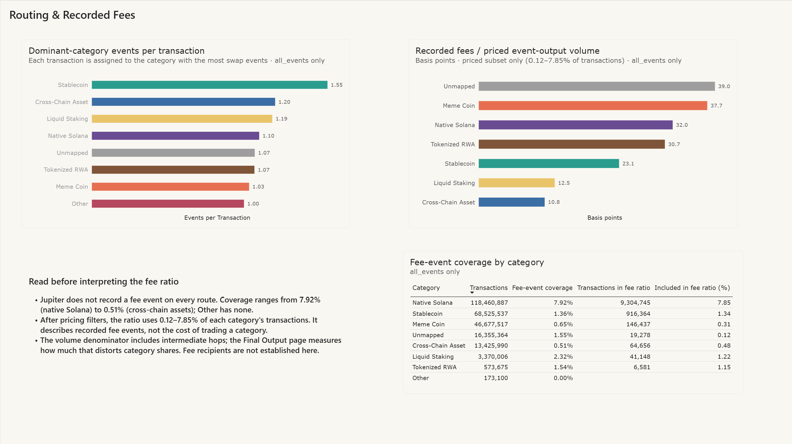
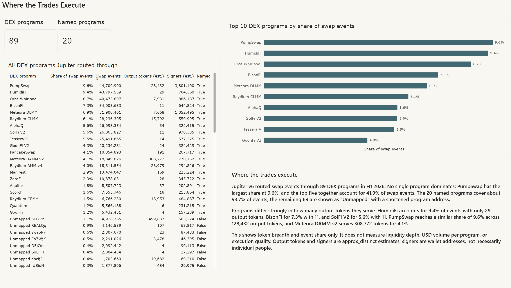
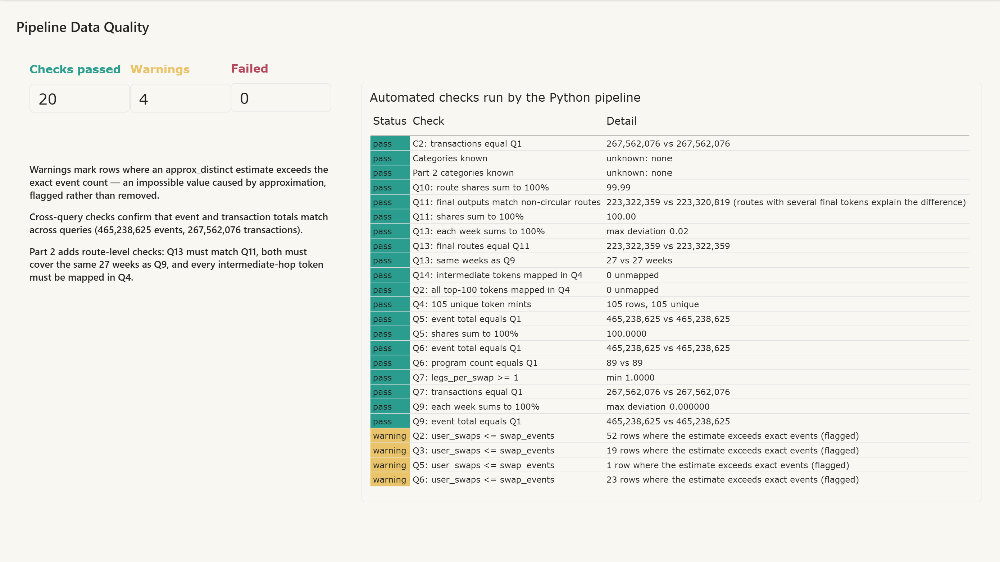
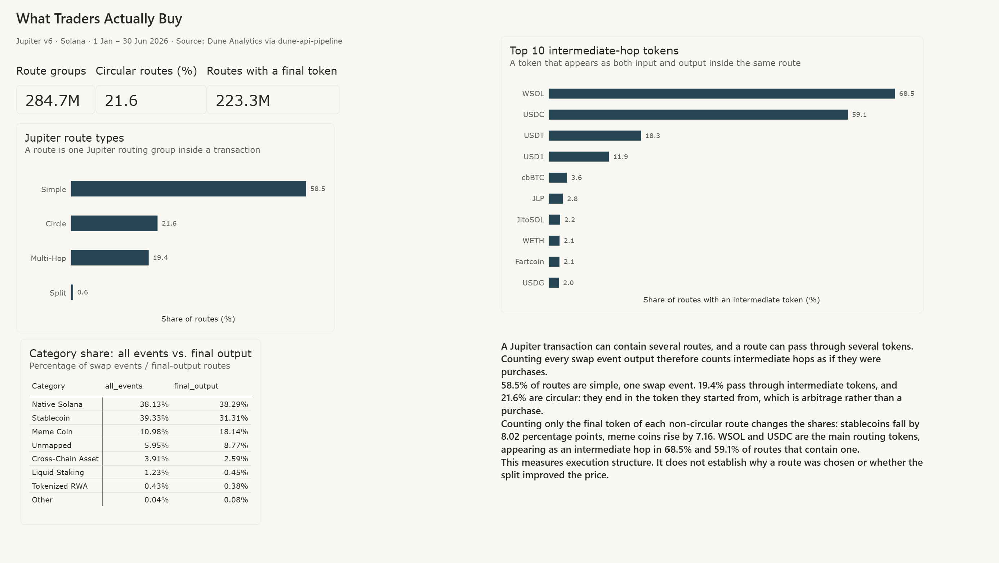

# Dune API Pipeline — Jupiter v6 Trading Data for Power BI

An ETL pipeline: stored query results are fetched from the Dune API, cleaned and
validated in Python, modelled as a star schema, and presented in a seven-page
Power BI dashboard.

**Data source:** [solana-jupiter-trading-analysis](https://github.com/Amirhouschang/solana-jupiter-trading-analysis)
— SQL analysis of Jupiter v6 swaps on Solana, H1 2026.

```
Dune (SQL on 465M rows) → Dune API → Python (extract, clean, check, model) → CSV → Power BI
```

Heavy computation stays in SQL on Dune. Python handles what SQL results do not:
cleaning, validation across queries, and a model built for a BI tool.

---

## What the pipeline does

**Extract** (`extract.py`)
- Reads the latest stored result of 15 queries. Queries are never re-executed.
- Paginates, retries on rate limits and server errors, validates row counts.
- Caches every result in `data/raw/`, so the pipeline also runs without the API.

**Clean** (`transform.py`)
- Removes null bytes from token symbols (e.g. `ZEC\x00\x00…`).
- Corrects wrong or missing metadata by mint address (`test` → PENGU, `SPLT` → BIRB, missing → bSOL).
- Parses Dune timestamps and enforces numeric types.

**Check** — 21 automated checks, written to `data/clean/quality_checks.csv`
- Cross-query totals: event and transaction totals in Q5, Q6, Q7, C2 and Q9 must equal Q1.
- Shares sum to 100%; each week in Q9 and Q13 sums to 100%.
- Part 2: Q13 must match Q11, both must cover the same 27 weeks as Q9, and final
  outputs must match non-circular routes.
- Every top-100 token and every intermediate-hop token is mapped in Q4; no unknown categories.
- `approx_distinct` estimates above exact event counts are flagged as warnings.

**Model** — star schema in `data/clean/`

| Table | Grain |
|---|---|
| `dim_token` | one row per mapped token (105) |
| `dim_category` | one row per category |
| `dim_dex` | one row per DEX program (89) |
| `dim_week` | one row per week, with partial-week flag |
| `fact_token_activity` | token |
| `fact_category_distribution` | category × mapping method × counting method |
| `fact_dex_usage` | DEX program |
| `fact_routing` | category |
| `fact_fees` | category, with fee-event coverage |
| `fact_weekly_category` | week × category × counting method |
| `fact_route_type` | Jupiter route type |
| `fact_intermediate_token` | intermediate routing token |
| `kpi_baseline` | single row of headline figures |

### Two counting methods

The `method` column separates how a category was assigned:

- **`all_events`** — every swap event output is counted, including intermediate
  routing hops (465,238,625 events).
- **`final_output`** — only the final token of each non-circular Jupiter route is
  counted, which is what the trader actually receives (223,322,359 routes).

The `observations` column holds the matching count for each method — swap events
or final-output routes. The two are different units, so **only shares are
comparable between methods**, not absolute numbers.

---

## Setup

Requires Python 3.10+. Tested on Linux.

**With Miniconda (recommended)**

```bash
conda env create -f environment.yml
conda activate dune-api
```

**With venv (alternative)**

```bash
python -m venv .venv
source .venv/bin/activate
pip install -r requirements.txt
```

**API key**

```bash
cp .env.example .env    # then add your Dune API key to .env
```

## Run

```bash
python main.py            # fetch from the API, fall back to cache on failure
python main.py --offline  # use cached results only, no API key needed
```

The exit code is 1 if any check fails, so the pipeline can be used in automation.

`data/raw/` holds a snapshot of the query results and is part of the repository,
so the pipeline can be reproduced with `--offline` without a Dune account.

---

## Power BI dashboard

File: `powerbi/jupiter_trading_dashboard.pbix` (Power BI Desktop, Windows)

### Model

All CSVs from `data/clean/` are loaded; `data/raw/` is not used by Power BI.
`dim_method` is a two-row table entered directly in Power BI and joined to every
fact table that carries a `method` column.



Relationships (all one-to-many, single direction, from dimension to fact):

- `dim_category[category]` → `fact_category_distribution`, `fact_routing`, `fact_fees`, `fact_weekly_category`, `dim_token`
- `dim_token[token_mint]` → `fact_token_activity`, `fact_intermediate_token`
- `dim_dex[dex_program]` → `fact_dex_usage[dex_program]`
- `dim_week[week_start]` → `fact_weekly_category[week_start]`
- `dim_method[method]` → `method` in all fact tables that have both counting methods

`kpi_baseline`, `quality_checks` and `fact_route_type` have no relationships:
the first holds single-row headline figures, the second the pipeline check log,
the third four route types. `dim_dex` / `fact_dex_usage` form a separate star,
because the DEX query is not broken down by category, token or week.

### Measures

Shares and ratios are recomputed as DAX measures instead of summing
pre-computed columns, so they stay correct under any filter and work for both
counting methods:

| Measure | Definition |
|---|---|
| `Share of Events %` | category observations / all observations |
| `Weekly Share %` | category observations / all observations in the week |
| `Events per Transaction` | dominant-category events / transactions |
| `Fee bps` | recorded fees × 10,000 / priced event-output volume |
| `Fee Event Coverage %` | transactions with a fee event / all transactions |
| `DEX Share %` | program swap events / all swap events |
| `Avg Priced Event USD` | priced volume / priced swap events |
| `Category Color`, `Token Category Color`, `Status Color` | consistent colours across visuals |
| `Checks Passed` / `Warning` / `Failed` | counts from `quality_checks` |

Estimated distinct counts (`_est`) are never summed across categories, because
the same signer or transaction can appear in several groups.

### Pages

**1. Overview** — headline KPIs, weekly trading activity, key findings



**2. Tokens** — top 10 by estimated transactions vs. top 10 by priced
event-output volume, with a full token table (`all_events` only, because token
data exists at event level)



**3. Categories** — share of trading activity, weekly composition, and the split
between manually mapped and suffix-matched tokens. The Method slicer switches the
whole page between both counting methods.

Counting every swap event output:



Counting only the final token of each route:



**4. Routing & Fees** — dominant-category events per transaction, recorded fee
ratio, and the fee-event coverage the ratio depends on (`all_events` only)



**5. DEX Programs** — top 10 programs and all 89 programs Jupiter routed through



**6. Data Quality** — results of the 21 automated pipeline checks



**7. Final Output** — route types, the category shift between the two counting
methods, and the tokens Jupiter routes through



### Refreshing

After re-running the pipeline, click **Refresh** in Power BI. The CSVs must stay
in the same folder under the same names. If a CSV gains columns, the `Columns =`
parameter in the query's `Source` step has to be raised to match.

---

## Repository structure

```
dune-api-pipeline/
├── README.md
├── environment.yml
├── requirements.txt
├── .env.example
├── .gitignore
├── config.py            # query IDs, paths, period, counting methods
├── extract.py           # Dune API client with caching
├── transform.py         # cleaning, checks, star schema
├── main.py              # pipeline entry point
├── data/
│   ├── raw/             # cached API results (15 queries)
│   └── clean/           # 13 tables + quality_checks.csv for Power BI
└── powerbi/
    ├── jupiter_trading_dashboard.pbix
    └── screenshots/
        ├── 00_data_model.png
        ├── 01_overview.png
        ├── 02_tokens.png
        ├── 03_categories.png
        ├── 03b_categories_final_output.png
        ├── 04_routing_fees.png
        ├── 05_dex_programs.png
        ├── 06_data_quality.png
        └── 07_final_output.png
```

---

## Limitations

- The pipeline reads results; it does not change them. All analytical limitations
  of the source project apply (price coverage, fee-event coverage, approximation).
- Columns ending in `_est` are `approx_distinct` estimates (~2% error). At small
  counts an estimate can exceed the exact event count; such rows are flagged.
- `observations` holds different units per method — swap events or final-output
  routes — so only shares are comparable between the two.
- Token, routing and fee data exist at event level only (`all_events`). Final-output
  analysis is at route level.
- `fact_token_activity` combines the top 100 by events and the top 50 by priced
  volume; five tokens only have volume figures, and tokens outside the top 50 have
  no volume. Blank values in the dashboard reflect this.
- The dashboard describes execution activity. The fee ratio covers only
  0.12–7.85% of transactions per category.

## Security

The API key is read from `.env`, which is excluded by `.gitignore`. Never commit it.
